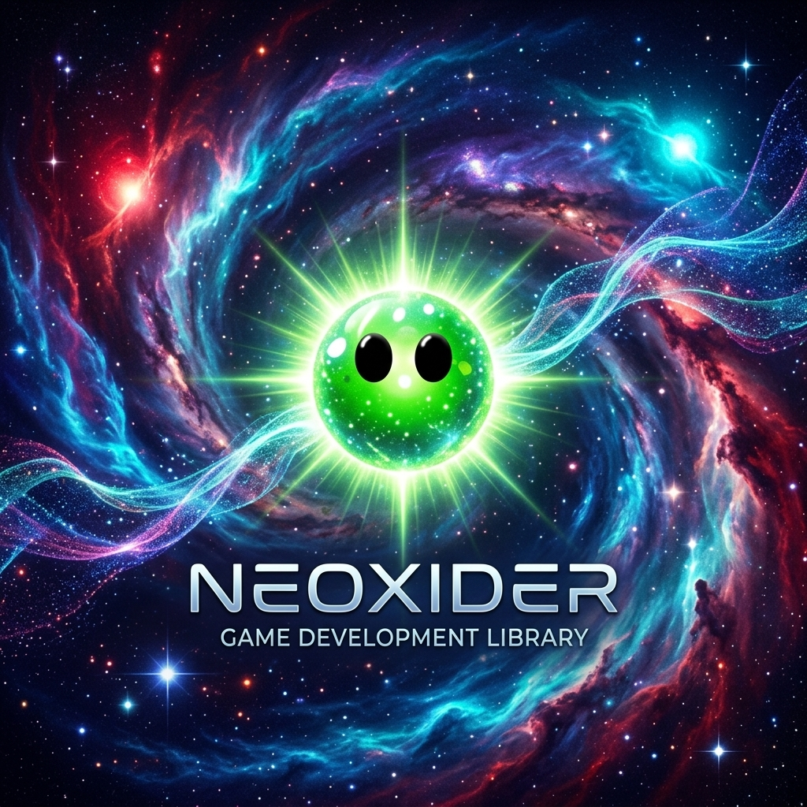

# Neoxider — a collection of powerful tools for Unity



[🇺🇸 English](README.md) | [🇷🇺 Русский](README_RU.md)

[]() []() []()

> **EN:** Ready-to-use Unity tools that integrate easily into your project. 150+ modules for fast game development without unnecessary complexity.
> 
> **RU:** Готовые решения для Unity, которые легко интегрируются в ваш проект. Более 150 модулей для быстрой разработки игр без лишних сложностей.

**Neoxider** is an ecosystem of ready-to-use Unity tools, built by developers for developers. Easy to configure through Inspector, no deep code diving required, yet fully transparent and extensible. Perfect for prototyping and production projects.

**Neoxider** — экосистема готовых инструментов для Unity, созданная разработчиками для разработчиков. Легко настраивается через Inspector, не требует глубокого погружения в код, но остаётся полностью прозрачной и расширяемой. Идеально подходит для прототипирования и продакшн-проектов.

📖 **[Full documentation (RU) →](Assets/Neoxider/Docs/README.md)** · 📖 **[English docs →](Assets/Neoxider/DocsEn/README.md)** · 📌 **[PROJECT_SUMMARY →](Assets/Neoxider/PROJECT_SUMMARY.md)** · 📝 **[Changelog →](Assets/Neoxider/CHANGELOG.md)**

**Documentation (EN):** [DocsEn/README.md](Assets/Neoxider/DocsEn/README.md) — English entry point for high-level modules and core pages; if a deep page is not translated yet, the index points to the corresponding Russian section. Tools submodules and samples (NeoxiderPages, UI Extension) are included in both indexes. **Документация (RU):** [Docs/README.md](Assets/Neoxider/Docs/README.md) — canonical index of all modules.

---

## 📑 Table of Contents

- [No-Code conditions — NeoCondition](#no-code-conditions--neocondition)
- [Why choose Neoxider](#why-choose-neoxider)
- [Demo Scenes](#demo-scenes)
- [Games built with NeoxiderTools](#games-built-with-neoxidertools) — games powered by the ecosystem
- [Demo Games](#demo-games)
- [Quick Start](#quick-start)
- [Modules Table](#modules-table)
  - [Condition](#condition--no-code-conditions) · [Tools](#tools) · [UI](#ui) · [Bonus](#bonus) · [Shop](#shop) · [Save](#save) · [Quest](#quest) · [Cards](#cards) · [StateMachine](#statemachine) · [Animations](#animations) · [Audio](#audio) · [Extensions](#extensions--c-extensions) · [Editor](#editor--editor-tools) · [Level](#level) · [NPC](#npc) · [Parallax](#parallax) · [GridSystem](#gridsystem) · [PropertyAttribute](#propertyattribute) · [Reactive](#reactive)
- [Top Modules](#top-modules)
- [Installation via UPM](#installation-via-upm) — [Dependencies](#dependencies), [Main Package](#main-package), [Manual Installation](#manual-installation)
- [Installing Demo Scenes and NeoxiderPages](#installing-demo-scenes-and-neoxiderpages)
- [FAQ](#faq)
- [Support and Contribution](#support-and-contribution)

---

## No-Code conditions — NeoCondition

Design complex game logic **without a single line of code**. The `NeoCondition` component allows you directly in the Inspector to:

- **Check any data** — HP, scores, object state, any public field or property of any component
- **Combine conditions** — AND/OR logic, inversion (NOT), multiple checks in a single component
- **React to changes** — events `OnTrue`, `OnFalse`, `OnResult` connect to any objects via UnityEvent
- **Check GameObject properties** — `activeSelf`, `tag`, `layer` and others — without extra components
- **Work with future objects** — find objects in the scene by name, configure conditions for prefabs before they spawn via Prefab Preview
- **Choose verification mode** — Interval, EveryFrame, Manual; the Only On Change filter eliminates unnecessary triggers

> **Example:** "When `Health.Hp <= 0` — show Game Over" — one setting in Inspector, zero lines of code.

📖 [NeoCondition Documentation →](Assets/Neoxider/Docs/Condition/NeoCondition.md)

---

## Why choose Neoxider

- **Production-ready** — each subsystem comes with examples, documentation, and thoughtful integrations
- **No-Code where needed** — most components are configured via Inspector and UnityEvent, yet remain extensible
- **Hybrid approach** — No-Code + Code for maximum flexibility
- **Modularity** — isolation via Assembly Definition Files, import only the modules you need
- **Extensibility** — inheritance, interfaces, public API for each component
- **Auto-save** — powerful save attributes module, many scripts store data automatically
- **Built-in documentation** — each module has its own README in `Assets/Neoxider/Docs/`

> Pay special attention to the **Extensions** module if you like writing code — 300+ extension methods for C# and Unity API.
> Many scripts support code-based interaction: Singleton, ChanceSystem, Timer and others.

---


## Demo Scenes


## Games built with NeoxiderTools

> **EN:** Shipping titles and jams that build on **NeoxiderTools** (including inspector-driven workflows).
> **RU:** Реальные релизы и демо, где **NeoxiderTools** — основа геймплея (в т.ч. no-code в Inspector).  

| Game · Игра | Genres · Жанры | Platform | Link · Ссылка | Notes · Примечание |
|-------------|----------------|----------|---------------|--------------------|
| [**Fake Grandkids** *(Внуки понарошку)*](https://myindie.ru/games/game/fake-grandkids) | Arcade, Survival | Windows | [MyIndie — store page](https://myindie.ru/games/game/fake-grandkids) | RU; **UralGameJam 2026**; logic via NeoCondition and NeoxiderTools ecosystem · v7.8.0|

## Demo Games


---

## Quick Start

1. **Install dependencies** — Unity 2022+ (recommended)
2. **Import** the `Assets/Neoxider` folder into your project (or via [UPM](#installation-via-upm))
3. **Add the system prefab** `Prefabs/--System--.prefab` to the scene — event managers and UI
4. **Drag and drop components** from Inspector — most work without code via UnityEvent
5. **Explore the documentation** — open the README in `Docs/` for the required module

## Tests

- Baseline `EditMode` tests are located in `Assets/Neoxider/Editor/Tests/`.
- They cover critical scenarios for `Save`, `Level`, `Bootstrap` and legacy/editor behaviors.
- Use `Test Runner` or the `com.unity.test-framework` package to run them in Unity.

---

## Modules Table

| Module | Description |
|--------|-------------|
| ⚙️ [**Condition**](#condition--no-code-conditions) | No-Code conditions: field validation, AND/OR logic, events |
| 🛠️ [**Tools**](#tools) | 150+ components: movement, physics, spawners, timers, input |
| 🖼️ [**UI**](#ui) | UI panels, button animations, toggles |
| 🎁 [**Bonus**](#bonus) | Slots, fortune wheel, collections, time rewards |
| 🛒 [**Shop**](#shop) | Shop, currency, purchases |
| 💾 [**Save**](#save) | PlayerPrefs, JSON files, `[SaveField]` attribute |
| 📜 [**Quest**](#quest) | Quest configs, manager, objectives, runtime state |
| 📈 [**Progression**](Assets/Neoxider/Docs/Progression/README.md) | XP, levels, unlock tree, perk tree and persistent progression |
| 🃏 [**Cards**](#cards) | MVP architecture, poker, "Drunkard" |
| 🤖 [**StateMachine**](#statemachine) | Code + No-Code, visual editor |
| ✨ [**Animations**](#animations) | Float, Color, Vector3 animations |
| 🎵 [**Audio**](#audio) | AudioManager, mixer, random music |
| 🔌 [**Extensions**](#extensions--c-extensions) | 300+ extension methods |
| 🛠️ [**Editor**](#editor--editor-tools) | Settings windows, missing scripts finder, auto-build |
| 🗺️ [**Level**](#level) | Level manager, map |
| 🚶 [**NPC**](#npc) | NPC navigation, patrol, chase, and animator driver |
| 🌌 [**Parallax**](#parallax) | Parallax layers |
| 🔲 [**GridSystem**](#gridsystem) | Grid generation, origin anchor, pathfinding, Match3/TicTacToe |
| 🏷️ [**PropertyAttribute**](#propertyattribute) | `[Button]`, `[GUIColor]`, inject attributes |
| ⚡ [**Reactive**](#reactive) | Reactive serializable `float`, `int`, `bool` properties |

---

## Modules

### Condition — No-Code conditions

- **NeoCondition** — check any fields/properties of components and GameObjects via Inspector
- **AND/OR logic**, inversion (NOT), multiple conditions in a single component
- **Source Mode** — reading data from components or properties of the GameObject itself (`activeSelf`, `tag`, `layer`)
- **Find By Name** — find objects in the scene by name with caching
- **Wait For Object + Prefab Preview** — setup conditions for prefabs before spawning
- Events: `OnTrue`, `OnFalse`, `OnResult(bool)`, `OnInvertedResult(bool)`

📖 [Documentation →](Assets/Neoxider/Docs/Condition/NeoCondition.md)

### Tools

The largest category — building blocks for your games:

| Submodule | Components |
|-----------|------------|
| **Components** | Counter, Health, ScoreManager, DialogueManager, Loot, TypewriterEffect, AttackSystem |
| **Input** | SwipeController, MouseInputManager, MouseEffect, MultiKeyEventTrigger |
| **Movement** | MovementToolkit, Follow, CameraConstraint, DistanceChecker |
| **Physics** | ExplosiveForce, ImpulseZone, MagneticField |
| **Spawner** | ObjectPool, Spawner, SimpleSpawner |
| **Managers** | Singleton, GM, EM, Bootstrap |
| **Random** | ChanceManager, ChanceSystemBehaviour |
| **Time** | Timer, TimerObject |
| **Debug** | ErrorLogger, FPS |
| **Draw** | Drawer (lines, colliders) |
| **FakeLeaderboard** | Leaderboard, LeaderboardItem |
| **InteractableObject** | InteractiveObject, PhysicsEvents2D/3D |

📖 [Documentation →](Assets/Neoxider/Docs/Tools/README.md) | [Physics →](Assets/Neoxider/Docs/Tools/Physics/README.md)

### UI

- **UI** — UI panels (pages) manager
- **ButtonScale / ButtonShake** — button animations
- **AnimationFly** — "flying" elements animation
- **VisualToggle** — universal visual state toggle
- **VariantView** — visual states management

📖 [Documentation →](Assets/Neoxider/Docs/UI/README.md)

### Bonus

- **Slot** — slot machine
- **WheelFortune** — fortune wheel
- **Collection** — collections system
- **TimeReward** — time-based rewards
- **LineRoulett** — linear roulette

📖 [Documentation →](Assets/Neoxider/Docs/Bonus/README.md)

### Shop

- **Shop** — central controller
- **ShopItem** — visual representation of an item
- **Money** — currency system
- **ButtonPrice** — button with a price
- **TextMoney** — UI display of money

📖 [Documentation →](Assets/Neoxider/Docs/Shop/README.md)

### Save

- **SaveProvider** — static API (like PlayerPrefs)
- **ISaveProvider** — interface for custom providers
- **SaveManager** — core system
- **GlobalSave** — global storage
- **SaveableBehaviour** — base class for saveable components

📖 [Documentation →](Assets/Neoxider/Docs/Save/README.md)

### Quest

- **QuestConfig** — quest ScriptableObject: ID, title, description, objectives, start conditions
- **QuestManager** — accepting quests, tracking progress, events, and Condition Context
- **QuestState** — runtime quest state and objectives progress
- **QuestNoCodeAction** — universal no-code bridge for UnityEvent
- **NotifyKill / NotifyCollect** — increment counter-objectives without manual state traversal

📖 [Documentation →](Assets/Neoxider/Docs/Quest/README.md)

### Cards

- **MVP architecture**: Model, View, Presenter
- **CardComponent, DeckComponent, HandComponent, BoardComponent**
- **Poker** submodule with combinations
- **DrunkardGame** — ready-to-play "Drunkard" game

📖 [Documentation →](Assets/Neoxider/Docs/Cards/README.md)

### StateMachine

- Code implementation via `IState` interface
- No-Code configuration via ScriptableObject
- Predicate system for complex transition conditions
- Visual editor in Inspector

📖 [Documentation →](Assets/Neoxider/Docs/StateMachine/README.md)

### Animations

- **FloatAnimator** — animating float values
- **ColorAnimator** — animating colors
- **Vector3Animator** — animating vectors

📖 [Documentation →](Assets/Neoxider/Docs/Animations/README.md)

### Audio

- **AMSettings** — audio manager settings
- **RandomMusicController** — random music controller
- **SettingMixer** — mixer management
- **AudioSimple** — simplified playback system

📖 [Documentation →](Assets/Neoxider/Docs/Audio/README.md)

### Extensions — C# Extensions

300+ extension methods:
- **Transform** — position, rotation, scale, hierarchy
- **Collections** — ForEach, Shuffle, GetRandom, FindDuplicates
- **String** — CamelCase, Truncate, Bold, Rainbow, Gradient
- **Random** — Chance, WeightedIndex, RandomColor
- **Coroutine** — Delay, WaitUntil, RepeatUntil
- **Color, Audio, Screen, Layout** and much more

📖 [Documentation →](Assets/Neoxider/Docs/Extensions/README.md)

### Editor — Editor Tools

- **NeoxiderSettingsWindow** — global settings window
- **FindAndRemoveMissingScripts** — missing scripts finder
- **TextureMaxSizeChanger** — bulk texture resizing
- **SaveProjectZip** — project backups
- **AutoBuildName** — automatic build naming
- **NeoUpdateChecker** — auto update checker via GitHub

📖 [Documentation →](Assets/Neoxider/Docs/Editor/README.md)

### Level

- **LevelManager** — level manager
- **LevelButton** — level button
- **Map** — level map

### NPC

- **NpcNavigation** — NPC movement with patrol and chase logic
- **NpcAnimatorDriver** — syncing movement state with Animator
- Used in conjunction with movement/nav workflows and animation binders

📖 [Documentation →](Assets/Neoxider/Docs/NPC/README.md)

### Parallax

- **ParallaxLayer** — parallax with preview, gap-handling, randomization

### GridSystem

- **FieldGenerator** — field generator
- **FieldCell** — field cell
- **FieldSpawner** — spawning objects on the field
- **GridShapeMask + Origin** — arbitrary shapes and grid anchor
- **GridPathfinder** — pathfinding with diagnostics for missing paths
- **Match3 / TicTacToe** — applied game add-ons + demo scenes

### PropertyAttribute

- `[Button]` — buttons in Inspector from methods
- `[GUIColor]` — field colorization
- `[RequireInterface]` — interface validation
- Inject attributes: `[GetComponent]`, `[FindInScene]`, `[LoadFromResources]`

📖 [Documentation →](Assets/Neoxider/Docs/PropertyAttribute/README.md)

### Reactive

- **ReactivePropertyFloat** — serializable reactive `float` value
- **ReactivePropertyInt** — serializable reactive `int` value
- **ReactivePropertyBool** — serializable reactive `bool` value
- **SetValueWithoutNotify / ForceNotify** — notification control during loading and manual sync

📖 [Documentation →](Assets/Neoxider/Docs/Reactive/README.md)

---

## Top Modules

- **NeoCondition** — No-Code conditions: check any data and build logic entirely in Inspector
- **Counter** — universal counter with arithmetic, events, and auto-save
- **SpineController** — facade for Spine with UnityEvent wrappers and auto-completion
- **ParallaxLayer** — parallax with preview and automatic tile recycling
- **DialogueManager** — dialogues with characters, portraits, and events on each line
- **ChanceManager** — declarative probability system for loot and roulettes
- **ObjectPool / Spawner** — extensible pool with waves and random prefab selection
- **MovementToolkit** — movement controllers (keyboard, mouse, 2D/3D, follow-cameras)
- **Physics** — ExplosiveForce, ImpulseZone, MagneticField with custom modes
- **Timer / TimerObject** — timers with pause, replay, and progress events

---

## Installation via UPM

### Dependencies

| Package | Installation Method |
|---------|---------------------|
| **Input System** (`com.unity.inputsystem`) | Recommended for Input / swipe modules; already in project template via `Packages/manifest.json`. Listed as dependency in UPM package for compatibility. |
| **UniTask** | Git URL: `https://github.com/Cysharp/UniTask.git?path=src/UniTask/Assets/Plugins/UniTask` |
| **DOTween** | [Asset Store](https://assetstore.unity.com/packages/tools/animation/dotween-hotween-v2-27676) |
| **DOTween Pro** (for NeoxiderPages) | Asset Store — required for the NeoxiderPages sample module |

### Main Package

```
https://github.com/NeoXider/NeoxiderTools.git?path=Assets/Neoxider
```

Window -> Package Manager -> **+** -> Add package from git URL.

If you need a specific version, append the tag to the URL (e.g., `#5.5.2`):

```
https://github.com/NeoXider/NeoxiderTools.git?path=Assets/Neoxider#5.5.2
```

### Manual Installation

Copy the `Assets/Neoxider` folder into your Unity project.

---

## Installing Demo Scenes and NeoxiderPages

After installing the main package via UPM, additional modules are available through the **Package Manager**:

1. **Window -> Package Manager** -> find **Neoxider Tools** (In Project)
2. In the right panel at the bottom — **Samples** section
3. Click **Import** next to the required module:
   - **Demo Scenes** — demo scenes and usage examples
   - **NeoxiderPages** — pages and screens module (PageManager, UIPage, UIKit), requires **DOTween Pro**

Files are copied to `Assets/Samples/Neoxider Tools/<version>/`.

> Alternatively: download `.unitypackage` from [Releases](https://github.com/NeoXider/NeoxiderTools/releases)

**Quick page call:**

```csharp
UIKit.ShowPage("PageEnd");
// or
PM.I.ChangePageByName("PageEnd");
```

`PageSubscriber` automatically looks up `PageId` by standard names: `PageGame`, `PageWin`, `PageLose`, `PageEnd` (configurable in Inspector).

---

## FAQ

**Can I use it selectively?** Yes, import only the needed folders — dependencies are listed in each module's documentation.

**Are there sample scenes?** Yes, in the `Demo` folder — minimal scenes for every major module.

**Does it work with 3D?** Most systems do. Exception: pure 2D solutions like `ParallaxLayer`.

---

## Support and Contribution

Neoxider is actively evolving. Found a bug or want to suggest a module? Open an issue/PR. All changes are documented in the [Changelog](Assets/Neoxider/CHANGELOG.md).

Good luck with your development!
